<div align="center">


# Absolute Cinema

**Your own streaming service. Self-hosted, powered by your Real-Debrid account.**

A Netflix-style web app for movies and TV that finds a stream the moment you press Play,
starts in seconds, seeks instantly, even in 4K, and plays the same way in every browser.

[](https://github.com/nsfwhusnain-coder/absolute-cinema/actions/workflows/ci.yml)


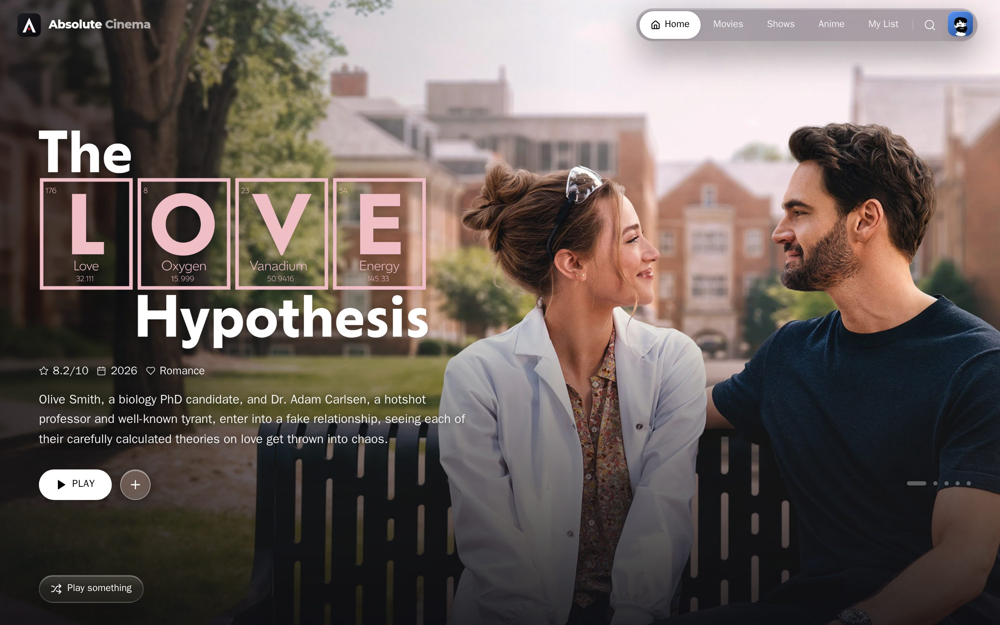

</div>

---

## Contents

- [Features](#features)
- [Screenshots](#screenshots)
- [Quick start](#quick-start)
- [First run](#first-run)
- [How playback works](#how-playback-works)
- [Configuration](#configuration)
- [Updating and backups](#updating-and-backups)
- [Development](#development)
- [Project structure](#project-structure)
- [FAQ](#faq)
- [Disclaimer](#disclaimer)

## Features

**Watching**
- **Press Play and it starts.** Real-Debrid cached releases and free web sources are searched in parallel, and the player starts on the best one this device can actually decode.
- **Real 4K that seeks instantly.** MKV releases, where nearly all 4K lives, are rewrapped on the fly into a standard HLS stream: the video is never re-encoded, the whole timeline is available from the first second, and jumping to any point starts playing in about three seconds.
- **Never switches mid-film.** Once a server is playing it stays. A dropped connection is retried on the same server at the same position; only a server that genuinely cannot keep up is swapped for the next one, seamlessly.
- **Remembers what worked.** Each title keeps a record of which server delivered it, at what resolution and how smoothly, so repeat plays and the next episode skip the search.
- **Smooth on slow servers too.** The server reads ahead the next segments while you watch, so providers that are slow to answer no longer cause play-pause-play; a server that still cannot keep up is swapped for another at the same spot.
- **A clean glass player.** One settings menu for subtitles, audio, quality, picture fit (fit, fill, stretch), speed, server, episodes, picture-in-picture, AirPlay and download; timeline previews, resume where you left off, a loading screen that says what it is doing, and full keyboard and touch control (tap to show controls, double-tap the sides to skip 10 seconds).
- **Made for binge-watching.** Skip Intro and Skip Credits for anime, a next-episode countdown, "Still watching?" after three episodes nobody touched, and your audio and subtitle choice remembered per show.

**Anime**
- An Anime section with trending, this season, top rated, films and genres.
- The right episode even when TMDB and the release groups number seasons differently (Bleach: Thousand-Year Blood War, One Piece), found through Kitsu.
- Subtitles and every audio track from inside the file: switch between Japanese with English subtitles and the English dub mid-episode.

**Browsing**
- Home with Top 10 Today, trending, new on digital, top rated, Popular Anime and what is on Netflix, Prime Video, Disney+, Apple TV+, Max and Hulu, plus "Because you watched…" and a Play Something shuffle.
- Movie and show pages with cast, trailers, the rest of a film's collection, full season lists, person pages, genre hubs and instant search.
- My List, Continue Watching and "already watched" tracking per profile.

**Household**
- **"Who's watching?"** Tap your profile and you are in. Profiles have a picture (26 illustrated avatars) and colour; anyone can add one, and each can choose to require a PIN. The first profile is the admin, who can close sign-ups or hide the picker.
- Everything is saved per profile: quality, audio and subtitle language, subtitle size, autoplay, theme, list and history.
- Adult-title filter per profile (behind the PIN when the profile has one).
- **Clear** (frosted glass, the default) and **Solid** themes, with six accent colours.
- Installable as an app (PWA) on phones, tablets and desktops; a TV mode with D-pad navigation works on smart-TV browsers.

**Self-hosting**
- One container, `docker compose up -d`, on any 64-bit Linux, macOS or Windows machine running Docker (amd64 or arm64). SQLite, no external database.
- Only two keys, TMDB and Real-Debrid, entered in the browser and verified before they are saved. They never reach the client.
- Live health in Settings, a health endpoint, rollback-safe updates and automatic database snapshots.

## Screenshots

| Who's watching | Title page |
|---|---|
| 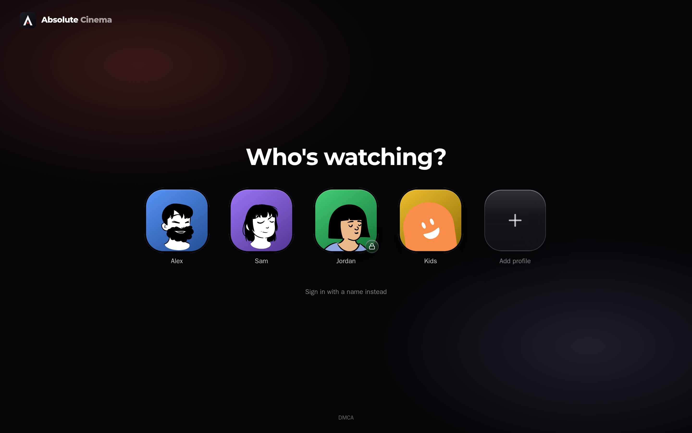 | 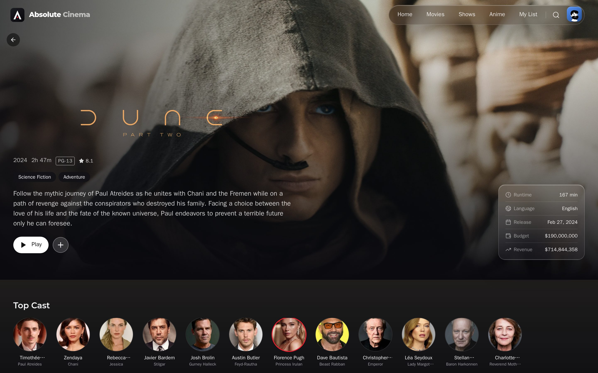 |
| **Player** | **Player settings** |
| 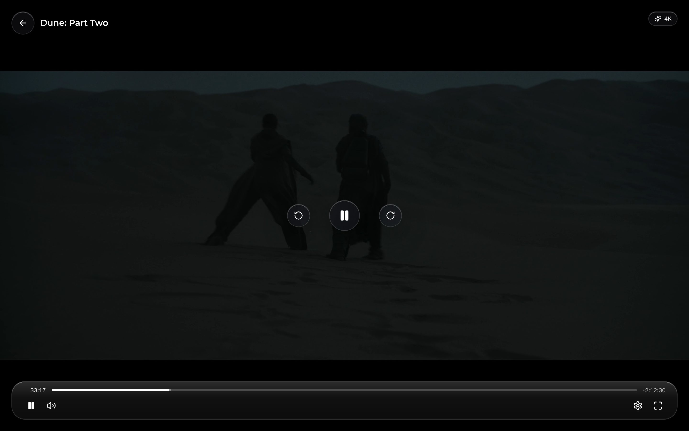 | 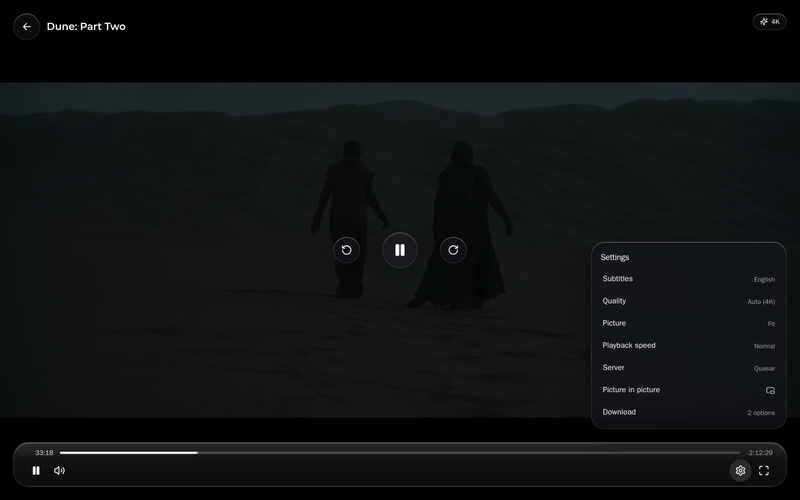 |
| **Starting up** | **Anime** |
|  | 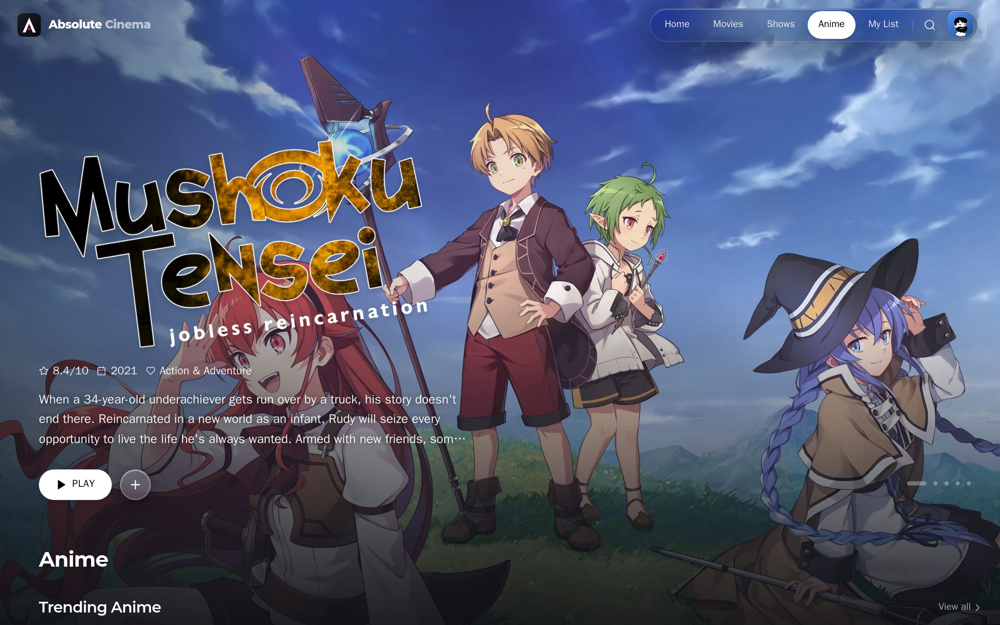 |
| **Season** | **Search** |
| 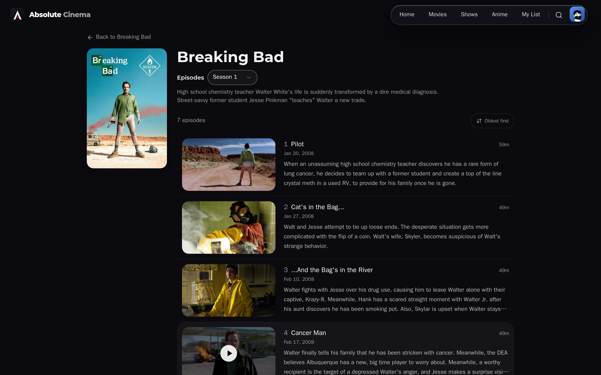 | 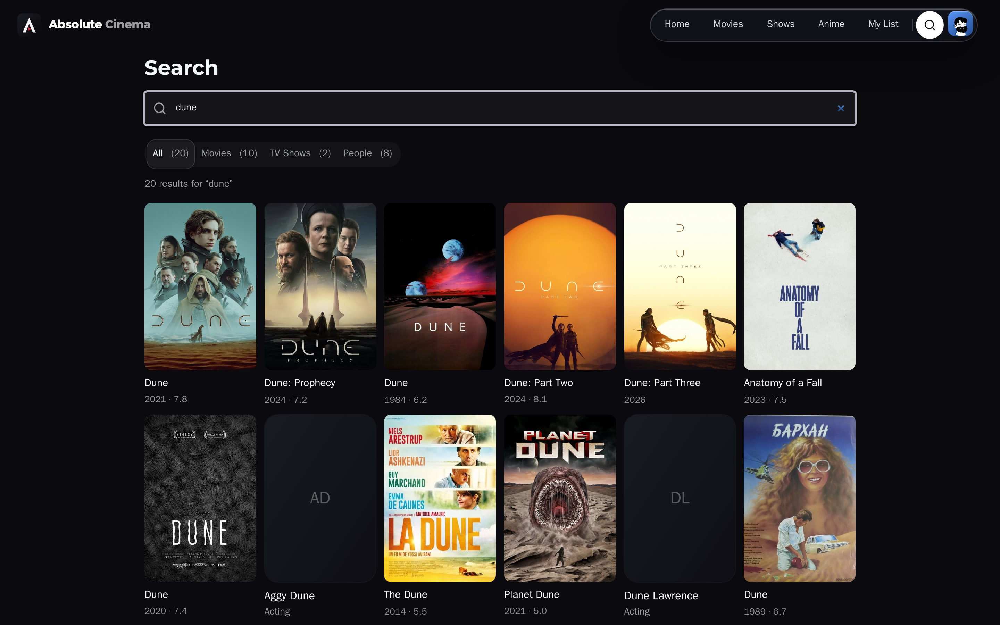 |
| **Settings** | **Create a profile** |
| 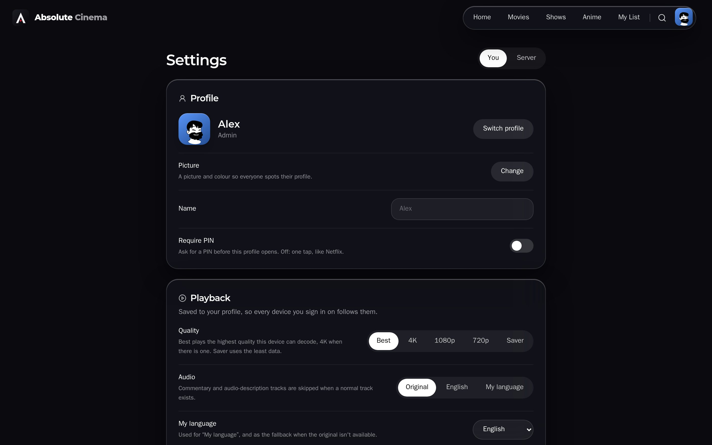 | 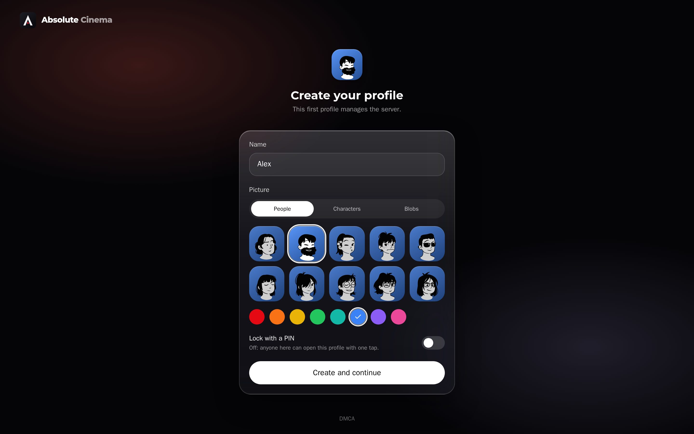 |

<div align="center">
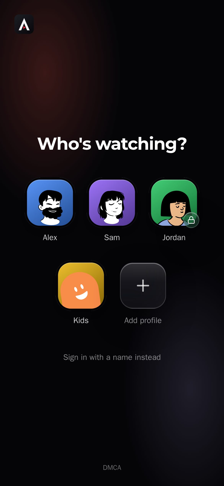
&nbsp;
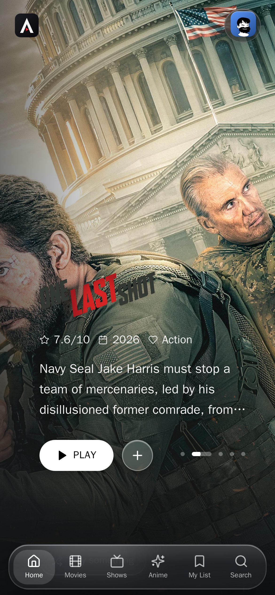
&nbsp;
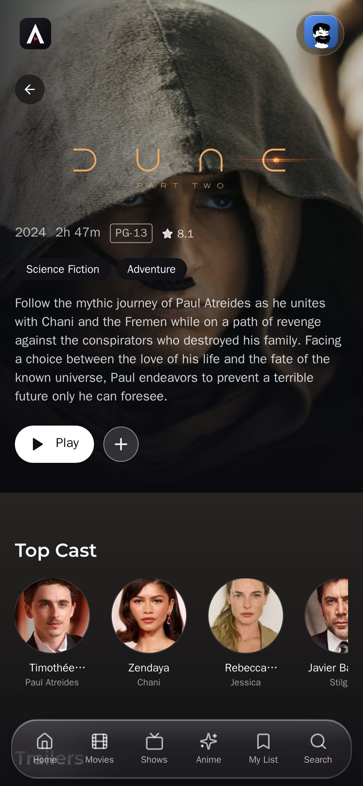
</div>

## Quick start

You need three things:

1. **Docker.** [Docker Desktop](https://www.docker.com/products/docker-desktop/) on Windows or macOS (on Linux, Docker Engine with the Compose plugin). Install it and start it once.
2. **A TMDB API key**, free: sign up at [themoviedb.org](https://www.themoviedb.org/signup), then [Settings → API](https://www.themoviedb.org/settings/api).
3. **A Real-Debrid account** for fast 1080p and 4K ([real-debrid.com](https://real-debrid.com/)). Optional: without it, free web sources are used.

### Windows

1. Download the project: the green **Code** button above → **Download ZIP**, then unzip it (or `git clone` it).
2. Open the folder, right-click **run.ps1** and choose **Run with PowerShell**.
   If Windows blocks it, open PowerShell in the folder and run:
   ```powershell
   powershell -ExecutionPolicy Bypass -File .\run.ps1
   ```

### macOS and Linux

```bash
git clone https://github.com/nsfwhusnain-coder/absolute-cinema.git
cd absolute-cinema
./run.sh
```

The script checks Docker, downloads the ready-made app (the first start takes a few
minutes), waits until it is up and prints the addresses:

```
  Absolute Cinema is running.
  On this computer:        http://localhost:3000
  On your phone or TV:     http://192.168.1.20:3000  (same Wi-Fi)
```

`./run.sh stop`, `./run.sh logs` and `./run.sh update` (or `.\run.ps1 stop` etc.) do what
they say. Prefer plain Docker? `docker compose up -d` does the same, and
`docker compose up -d --build` builds the app from this folder instead of downloading it.
To use a different port, create a `.env` file containing `AC_PORT=8080`.

## First run

1. **Create your profile.** Pick a name and a picture; this first profile is the admin. A PIN is optional (it is a good idea for the admin if other people use your network).
2. **Paste your TMDB key** when the setup screen asks. Either the *API Key* or the *API Read Access Token* works.
3. **Paste your Real-Debrid token** from [real-debrid.com/apitoken](https://real-debrid.com/apitoken). Optional, but it is what gives you fast 1080p and 4K.

Both keys are checked before they are saved and can be changed later in
**Settings → Server → Connections**. Everyone else just opens the site and taps
**Add profile**. To stop that, turn off *Anyone can add a profile* in
**Settings → Server → Profiles** and add people yourself.

## How playback works

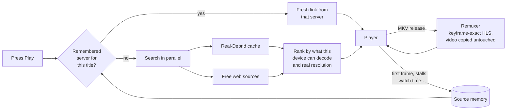

- **Sources arrive as they are found.** A quick answer (cache plus the fastest providers) comes back in one or two seconds and every later find streams in behind it. If only low-quality or known-flaky sources have turned up so far, the player waits a few seconds for something better, because whatever starts is kept for the whole title.
- **Seekable 4K without transcoding.** The remuxer reads the MKV's keyframe index over HTTP range requests, plans the whole title as an HLS playlist of exact keyframe-aligned segments, and produces each segment on demand with `ffmpeg -c:v copy`. Only audio is converted, to stereo AAC, so it plays everywhere. Seeking far ahead starts a new run at that keyframe; already-produced segments are reused.
- **Same behaviour in every browser.** Ranking only offers what the device can decode (HEVC and Dolby Vision where supported, H.264 or AV1 elsewhere), and one player engine handles HLS, native HLS on Apple devices, and plain files.
- **Source memory stores evidence, never URLs.** Debrid and CDN links expire; "this server delivered real 2160p for this episode and someone watched 40 minutes" does not.
- **Everything goes through your server.** Playlists and segments are proxied with SSRF protection, and debrid tokens are stripped from every URL before it reaches a browser.

## Configuration

Everything is optional. Copy [`.env.example`](.env.example) to `.env` to override defaults.

| Variable | Default | Purpose |
|---|---|---|
| `AC_PORT` | `3000` | Port the web UI is published on |
| `TMDB_API_KEY` | – | TMDB key (a key saved in Settings wins) |
| `REAL_DEBRID_API_TOKEN` | – | Real-Debrid token (a token saved in Settings wins) |
| `NEXTAUTH_URL` | – | Public URL, only when behind a reverse proxy with a fixed hostname |
| `NEXTAUTH_SECRET` | auto | Session secret; generated into `db/.auth-secret` on first start |
| `REMUX_ENABLED` | `1` | Serve MKV releases as seekable streams |
| `REMUX_CACHE_MAX_BYTES` | 50 GiB | Disk the remux cache may use |
| `REMUX_MIN_FREE_BYTES` | 5 GiB | Free space the remux cache always leaves |
| `BROWSER_POOL_SIZE` | `1` | Headless Chromium workers for web sources (1–4) |
| `TORBOX_API_KEY` | – | Optional TorBox account as an extra debrid source |
| `PROVIDER_<NAME>=0` | on | Disable an individual web source |

**Data** lives in three folders next to `docker-compose.yml`: `db/` (profiles, history,
settings), `data/source-memory/` (remembered servers) and `transcode-cache/` (remux
output; bounded by the settings above and safe to delete).

**Reverse proxy.** Put Caddy, nginx or Traefik in front of port 3000 and set `NEXTAUTH_URL`
to the public address. Disable response buffering for `/api/hls` and `/api/vod`.

**Hardware.** Anything that runs Docker: a mini PC, a NAS, a Raspberry Pi 5 or an old
laptop. Video is never re-encoded, so the CPU barely matters; 2 GB of RAM is enough.
For 4K, what counts is your internet connection (about 60–100 Mbit/s per stream) and
some free disk for the remux cache.

## Updating and backups

```bash
./scripts/update.sh
```

For a normal install, `./run.sh update` (or `.\run.ps1 update`) downloads the newest
release and restarts. `./scripts/update.sh` is for installs that follow the source: it
pulls the latest code, snapshots the database into `db-backups/`, tags the running image
for rollback, rebuilds and waits for the health check. If something goes wrong, it prints
the rollback tag:

```bash
docker tag absolute-cinema:rollback-<timestamp> ghcr.io/nsfwhusnain-coder/absolute-cinema:latest && docker compose up -d
```

## Development

Requirements: [Bun](https://bun.sh) 1.3+, Node.js 22+, and ffmpeg.

```bash
bun install
(cd mini-services/stream-scraper && bun install && bunx playwright install chromium)
cp .env.example .env               # set TMDB_API_KEY, or add it in Settings later
echo "DATABASE_URL=file:../db/dev.db" >> .env
bun run db:push

bun run dev                        # web app on :3000
bun run dev:scraper                # source resolver on :3030 (second terminal)
bun run dev:remuxer                # MKV remuxer on :3040 (third terminal)
```

| Command | What it does |
|---|---|
| `bun run test` | Unit tests for playback, ranking, the player state machine, remuxer, proxy, debrid and scrapers |
| `bun run typecheck` | TypeScript, no emit |
| `bun run lint` | ESLint |
| `bun run build` | Production build |
| `bun run smoke:playback` | Resolve a known title end to end against a running scraper |
| `bun run check:ssrf` | Verify the proxy's private-address guard |

## Project structure

```
src/
  app/                  Next.js routes (pages + API)
    api/playback/       sources for a title (quick + full answers)
    api/vod/            remux sessions: open, playlist, init and segments
    api/hls/            HLS proxy with SSRF protection
    api/profiles/       the "Who's watching?" list
  components/player/    player: orchestrator hook, media engine, glass UI
  lib/playback/         ranking, orchestrator state machine, source memory, debrid
  views/                page-level components (settings/ is one file per section)
mini-services/
  stream-scraper/       Bun service that resolves web sources (internal :3030)
  remuxer/              MKV → keyframe-exact HLS (internal :3040)
prisma/schema.prisma    SQLite schema
public/avatars/         profile pictures (CC0)
run.sh, run.ps1         one-command start for macOS/Linux and Windows
docker-entrypoint.sh    starts the scraper, remuxer and web app inside the container
workers/hls-proxy/      optional Cloudflare Worker edge proxy
scripts/                update, backup, disk and smoke-test tooling
```

## FAQ

**Do I need Real-Debrid?** No, but without it playback relies on free web sources, which are
slower, less reliable and usually top out at 1080p.

**Does 4K play in Chrome?** Yes, when the release is H.264 or AV1, or when your device can
decode HEVC (most recent Windows, macOS and Android devices can). Dolby Vision and HEVC
releases are only offered where they will actually play; otherwise you get the best
compatible version instead of an error.

**Why did it pick 1080p on my laptop?** *Best* quality always goes for 4K, but only among
copies this device can decode. When every 4K release of a title is HEVC and the browser
has no HEVC decoder, the best compatible version is 1080p.

**Where is my data stored?** In `db/` on your own server. Nothing is sent anywhere except
the requests to TMDB, Real-Debrid and the stream sources needed to play what you pick.

**Can several people watch at once?** Yes. Each profile has its own list, progress and
preferences, and each 4K stream gets its own remux session.

## Credits

- Profile pictures: [DiceBear](https://www.dicebear.com) styles *Lorelei* by Lisa Wischofsky, *Open Peeps* by Pablo Stanley and *Thumbs* by DiceBear, all CC0.
- Anime skip times: [AniSkip](https://aniskip.com), a community database. Anime ID mapping: [ani.zip](https://ani.zip) and [Kitsu](https://kitsu.io).
- Catalog data and images: [TMDB](https://www.themoviedb.org).

## Disclaimer

Absolute Cinema does not host, store or distribute any media. It is a front end that
searches third-party services and plays what they return, using accounts you provide.
You are responsible for complying with the laws of your country and the terms of the
services you connect. This project is not affiliated with TMDB, Real-Debrid or any
streaming service named above.

This product uses the TMDB API but is not endorsed or certified by TMDB.

## License

[MIT](LICENSE)
