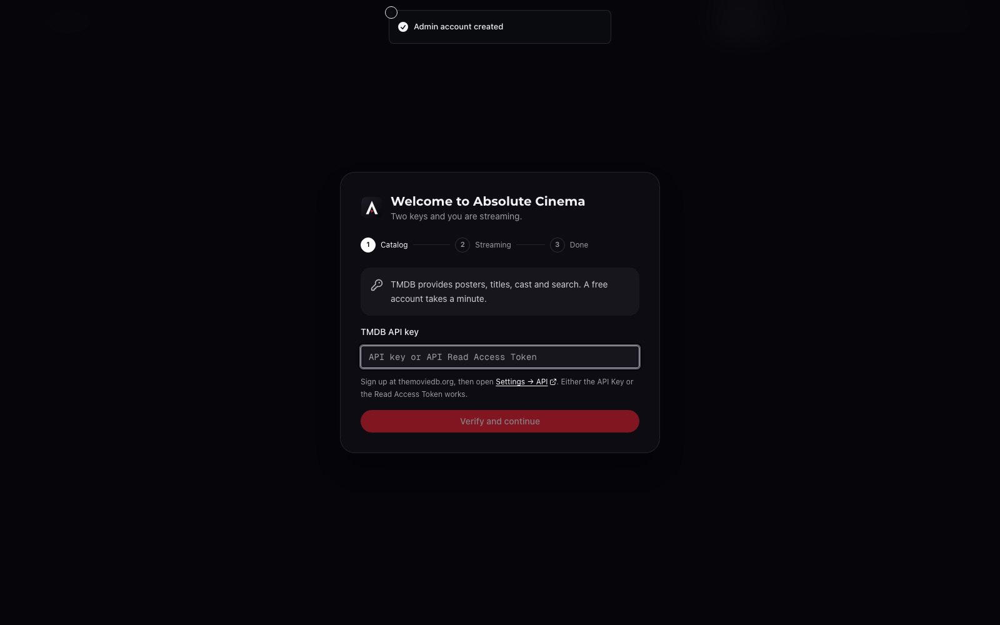
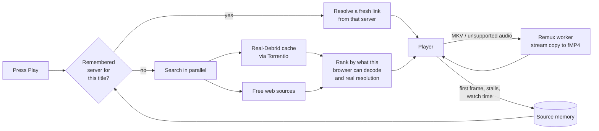

<div align="center">


# Absolute Cinema

**Your own streaming service. Self-hosted, powered by your Real-Debrid account.**

A Netflix-style web app for movies and TV that finds a stream the moment you press Play,
starts in seconds, and gets faster every time you watch.

[](https://github.com/nsfwhusnain-coder/absolute-cinema/actions/workflows/ci.yml)


</div>

---

## Contents

- [Features](#features)
- [Screenshots](#screenshots)
- [Quick start](#quick-start)
- [First-run setup](#first-run-setup)
- [How playback works](#how-playback-works)
- [Configuration](#configuration)
- [Updating and backups](#updating-and-backups)
- [Development](#development)
- [Project structure](#project-structure)
- [FAQ](#faq)
- [Disclaimer](#disclaimer)

## Features

**Watching**
- **Press Play and it just starts.** Real-Debrid cached releases and free web sources are searched in parallel; the best one that your browser can actually decode is picked automatically.
- **4K where it counts.** Real 2160p from Real-Debrid, with MKV releases rewrapped into a browser-friendly stream on the fly (no re-encode, ~10× realtime).
- **Remembers what worked.** Every title keeps a record of which server delivered it, at what resolution and how smoothly. Next time, that server is first in line, so repeat plays and next episodes skip the search.
- **Seek anywhere, with previews.** Hover the timeline to see thumbnails; jumping ahead in a 4K file starts a fresh stream at that point instead of waiting for it to download.
- **Automatic failover.** If a server stalls or dies, playback moves to the next one without you doing anything. Servers that keep failing are benched for the session.
- **Proper player.** Quality picker with honest per-server labels, audio track and subtitle selection (with preferences remembered), playback speed, next-episode countdown, resume from where you stopped, keyboard shortcuts and touch gestures.

**Browsing**
- Home rows for trending, new on digital, top rated and what is on Netflix, Prime Video, Disney+, Apple TV+, Max and Hulu, plus "Because you watched…" recommendations.
- Movie and show pages with cast, full season lists with synopses and air dates, person pages, genre hubs and instant search.
- My List, Continue Watching and "already watched" tracking per profile.

**Household**
- Multiple profiles with PIN sign-in; the first account is the admin.
- Adult-content filter per profile.
- Installable as an app (PWA) on phones, tablets and desktops. A TV mode with D-pad navigation works on smart-TV browsers (webOS, Tizen, Android TV).

**Self-hosting**
- One container, `docker compose up -d`, done. SQLite, no external database.
- API keys are entered in the browser and verified before they are saved; they never reach the client.
- A health endpoint, rollback-safe update script and automatic database snapshots.

## Screenshots

| Title page | Season |
|---|---|
|  |  |
| **Search** | **First-run setup** |
|  |  |

<div align="center">

&nbsp;&nbsp;

</div>

## Quick start

You need [Docker](https://docs.docker.com/get-docker/) with the Compose plugin, a free
[TMDB](https://www.themoviedb.org/signup) account and, for 1080p/4K, a
[Real-Debrid](https://real-debrid.com/) subscription.

```bash
git clone https://github.com/nsfwhusnain-coder/absolute-cinema.git
cd absolute-cinema
docker compose up -d
```

Open **http://localhost:3000** (or `http://<server-ip>:3000` from another device).

The first build takes a few minutes because it installs a headless browser and ffmpeg.
To use a different port, create a `.env` file containing `AC_PORT=8080`.

## First-run setup

1. **Create the admin account.** The first visit shows a sign-up form; that account becomes the admin.
2. **Add your TMDB key.** Get it from [themoviedb.org → Settings → API](https://www.themoviedb.org/settings/api). Either the *API Key* or the *API Read Access Token* works.
3. **Add your Real-Debrid token** (optional but recommended). Copy it from [real-debrid.com/apitoken](https://real-debrid.com/apitoken).

Both keys are checked against their services before they are saved, and can be changed
later in **Settings → Connections**. To let family members create their own profiles,
add them in **Settings → Server → Profiles**, or set `REGISTRATION_INVITE_CODE` and share the code.

## How playback works



- **Two-speed resolve.** A fast pass (cache and API-only sources) answers within a couple of seconds so video can start, while a full pass keeps looking in the background and upgrades the list.
- **Source memory stores evidence, never URLs.** Debrid and CDN links expire within hours; "this server delivered real 2160p H.264 for this episode and someone watched 40 minutes" stays true. On the next play a fresh link is fetched from that server first.
- **Browser-aware ranking.** HEVC/Dolby Vision releases are only offered where the browser can decode them (Safari, most TVs); Chrome and Firefox get H.264/AV1 4K or the best 1080p.
- **Remux, not transcode.** MKV files are rewrapped with `ffmpeg -c:v copy`. Only the audio is converted (to AAC) when the original codec is not browser-safe. Seeking restarts the remux at the new position.
- **Everything goes through your server.** HLS playlists and segments are proxied with SSRF protection, and debrid tokens are stripped from every URL before it reaches a browser.

## Configuration

Everything is optional. Copy [`.env.example`](.env.example) to `.env` to override defaults.

| Variable | Default | Purpose |
|---|---|---|
| `AC_PORT` | `3000` | Port the web UI is published on |
| `TMDB_API_KEY` | – | TMDB key (a key saved in Settings wins) |
| `REAL_DEBRID_API_TOKEN` | – | Real-Debrid token (a token saved in Settings wins) |
| `NEXTAUTH_URL` | – | Public URL, only when behind a reverse proxy with a fixed hostname |
| `NEXTAUTH_SECRET` | auto | Session secret; generated into `db/.auth-secret` on first start |
| `REGISTRATION_INVITE_CODE` | – | Lets people self-register with this code |
| `REMUX_ENABLED` | `1` | Rewrap MKV releases for the browser |
| `TRANSCODER_ENABLED` | `0` | Full re-encode for incompatible codecs (CPU heavy) |
| `TRANSCODER_CACHE_MAX_BYTES` | 100 GiB | Disk budget for remuxed files |
| `BROWSER_POOL_SIZE` | `1` | Headless Chromium workers for web sources (1–4) |
| `TORBOX_API_KEY` | – | Optional TorBox account as an extra debrid source |
| `PROVIDER_<NAME>=0` | on | Disable an individual web source |

**Data** lives in three folders next to `docker-compose.yml`: `db/` (accounts, history,
settings), `data/source-memory/` (remembered servers) and `transcode-cache/`
(temporary remux output, safe to delete).

**Reverse proxy.** Put Caddy, nginx or Traefik in front of port 3000 and set `NEXTAUTH_URL`
to the public address. Streaming responses are long-lived; disable response buffering for
`/api/hls` and `/api/transcode`.

**Hardware.** Any 64-bit Linux host with 2 GB RAM works for 1080p. 4K remuxing is I/O bound,
so disk speed and bandwidth matter more than CPU. Keep at least 30 GB free if you watch 4K.

## Updating and backups

```bash
./scripts/update.sh
```

This pulls the latest code, snapshots the database into `db-backups/`, tags the running
image for rollback, rebuilds and waits for the health check. If something goes wrong, the
script prints the rollback tag:

```bash
docker tag absolute-cinema:rollback-<timestamp> absolute-cinema:latest && docker compose up -d
```

## Development

Requirements: [Bun](https://bun.sh) 1.3+, Node.js 22+, and ffmpeg for remux work.

```bash
bun install
(cd mini-services/stream-scraper && bun install && bunx playwright install chromium)
cp .env.example .env               # set TMDB_API_KEY, or add it in Settings later
echo "DATABASE_URL=file:../db/dev.db" >> .env
bun run db:push

bun run dev                        # web app on :3000
bun run dev:scraper                # stream resolver on :3030 (second terminal)
```

| Command | What it does |
|---|---|
| `bun run test` | Unit tests (1,200+) for playback, ranking, proxy, debrid and scrapers |
| `bun run typecheck` | TypeScript, no emit |
| `bun run lint` | ESLint |
| `bun run build` | Production build |
| `bun run smoke:playback` | Resolve a known title end to end against a running scraper |
| `bun run check:ssrf` | Verify the proxy's private-address guard |

## Project structure

```
src/
  app/                  Next.js routes (pages + API)
    api/playback/       resolve sources for a title (fast + full passes)
    api/hls/            HLS/DASH proxy with SSRF protection
    api/transcode/      remux / transcode front door
  components/           UI; video-player.tsx is the player state machine
  lib/playback/         ranking, source memory, failover, debrid tier
  views/                page-level components
mini-services/
  stream-scraper/       Bun service that resolves web sources (internal :3030)
  transcoder/           ffmpeg remux / transcode worker (internal :3040)
prisma/schema.prisma    SQLite schema
workers/hls-proxy/      optional Cloudflare Worker edge proxy
scripts/                update, backup, disk and smoke-test tooling
```

## FAQ

**Do I need Real-Debrid?** No, but without it playback relies on free web sources, which are
slower, less reliable and usually top out at 1080p.

**Why doesn't 4K play in Chrome?** Most 4K releases are HEVC or Dolby Vision, which Chrome
and Firefox cannot decode. Absolute Cinema offers them only where they will play (Safari, Apple
devices, most smart TVs) and gives other browsers the best compatible version.

**Where is my data stored?** In `db/` on your own server. Nothing is sent anywhere except
requests to TMDB, Real-Debrid and the stream sources needed to play what you pick.

**Can several people watch at once?** Yes. Each profile has its own list, progress and
preferences. Concurrent 4K remuxes are limited to protect bandwidth and disk.

## Disclaimer

Absolute Cinema does not host, store or distribute any media. It is a front end that
searches third-party services and plays what they return, using accounts you provide.
You are responsible for complying with the laws of your country and the terms of the
services you connect. This project is not affiliated with TMDB, Real-Debrid or any
streaming service named above.

This product uses the TMDB API but is not endorsed or certified by TMDB.

## License

[MIT](LICENSE)
